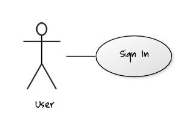
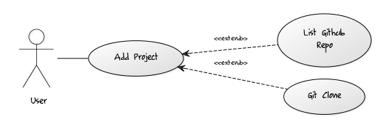
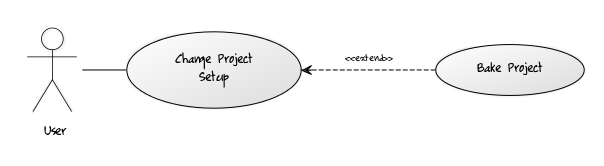
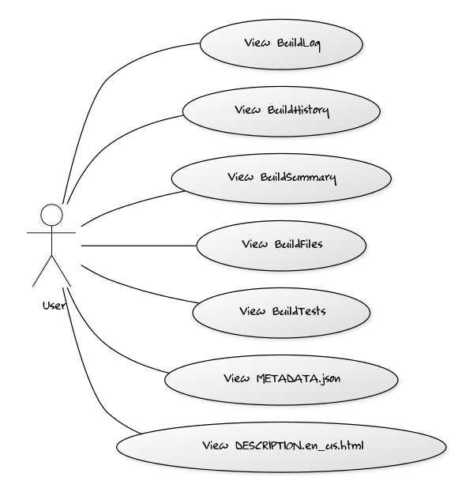

Use cases
=========

> UML Diagrams have been created by [yuml.me](http://www.yuml.me).

### 1. User can be signed in.

On the landing page user can click on `Login` button and enter to the fontbakery using his github account.

### 2. User can add project.

Authenticated user adds project

1. by entering git repo in home page
2. by selecting repoes from list of his github repoes page

### 3. User can change project setup

Authenticated user changes setup configuration of existing project and runs bakery project by clicking "Save and Bake" button

### 4. User can view all bake build info

After bakery process finished user gets ability to view build info

#### 4.1 Build Summary
#### 4.2 Build Log
#### 4.3 Result Files
#### 4.4 Build Tests
#### 4.5 Generated METADATA.json
#### 4.6 Content of DESCRIPTION.en_us.html
